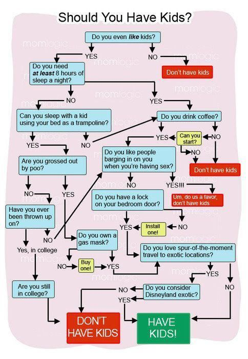
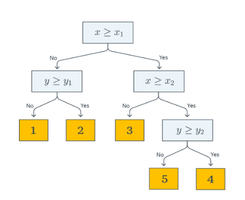
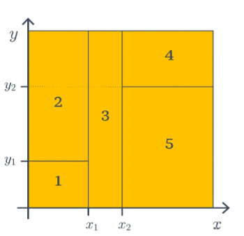

# Деревья

## Решающие деревья/Decision tree

### Небольшое введение
Все мы когда-либо видели подобные графики в ленте социальной сети. Да, базово в мемах там исход один, но на практике, отвечая на вопросы из таких графов("solving chart'ов"), вы решали задачу "принятия решения".



Сутево и "по-глупому", если посмотреть на относительно реальный пример, как для того же титаника, вы должны построить дерево, где каждый узел (в данном контексте он именуется "предикатом" - простое решающее правило) будет представлять собой какое-либо условие, а лист будет представлять себя какой-либо меткой класса. Соответственно, тут уже не нужны сигмоиды и софтмаксы даже для небинарной классификации.

 

Но обобщающая способность решающих деревьев невелика, их предсказания вычисляются довольно просто. Поэтому конкретно данный метод используется как "квартира" в "многоэтажке" моделей - ансамблевых методах.

### Разберем на примере

*Разбираем пример с последней пикчи, про небинарную классификацию.*

Объекты в этом примере имеют два признака, с какими-либо значениями $X$, $Y$.
Проходя по предикатом от корня к листам, в зависимости от верных или неверных суждений, получится та или иная метка класса. Т.е., если возвращаться к обывательскому мировозрению, дерево в данном случае выступает очень большим и вложенным блоком условий
```pseudo
if {
    if {
        ...
    } else {
        ...
    }
} else {
    ...
}
```
Конкретно в данном примере предикаты являются простым взятием порога/threshold по значению какого-то признака:  
#### $B(x,j,t)=[x_j \leq t]$
Данные, для такого конкретного примера распределены следующим образом:



### Определение решающего дерева
У нас есть какое-либо бинарное дерево, для которого:
    
- в каждом узле $v$ существует предикат $B_v : \mathbb{X} -> \{0,1\} $
- в каждой листовой $v$ существует прогноз $c_v \in \mathbb{Y}$, где $\mathbb{Y}$ -- область значений целевой переменной/вектор вероятностей классов.

Как уже было выяснено на примере, в ходе предсказания мы движемся по деревуу к некоторому листу. Для каждого объекта из $x$ движение начинается с корня. Проход идет вправо, если $B_v(x) = 1$, влево, если $B_v(x)=0$. Проход заканчивается только в случае, если дошли до какого-то листа. Тогда ответ модели будет некоторый $c_v$, который мы получили в конкретном листе.

Предикаты могут иметь произвольную форму, на практике чаще всего встретите сравнение с порогом $t \in \mathbb{R}$ по $j$'ому признаку, формула которого и объяснение были изложены выше.

Что можно сказать имея структуру нашего дерева?

- выученная функция -- кусочно-постоянная -> производная = 0, где задана -> градиентные методы отбрасываем
- дерево решений -- не сможет экстраполировать(распространять выводы) зависимости за границы области значений обучающей выборки 
- дерево решений может идеально приблизить обучающую выборку и ничего не выучить (низкая обобщающая способность), достаточно построить такое дерево, где каждый лист соответствует одному из признаков -> надо оставлять как можно более простым.

### Как построить дерево? По-жадному.

Построение оптимального решающего дерева с минимальной глубиной - задача сложная и поиск такого дерева - NP-полная задача. Почему -- описано хорошо в учебнике [ШАДа](https://education.yandex.ru/handbook/ml/article/reshayushchiye-derevya), если интересно, можете ознакомится. *Параграфы "Почему построение оптимального решающего дерева -- сложная задача", а так же "Алгоритмические трюки"*.
Мы же будем строить дерево жадно.

1. создаем вершину $v$. 
2. определяем, надо ли закончить дробление дерева. Чтобы понять, что конец, *условно* задаем три вопроса ($Stop(X_m)$):
    > все ли объекты одинаковые в нашей группе?

    > объектов достаточно для разделения? (если их, условно, 2, то дальше делить уже бесполезно)

    > не слишком ли глубоко мы вырастили наше дерево?

    если отвечая хоть на один из этих вопросов, мы даем ответ *да*, значит надо обозначить эту вершину $v$ листом и выдать ей ответ $Ans(X_m)$

3. Если останавливаться все таки рано, надо определить "лучший вопрос". Вопрос есмь предикат и $B_{j,t}$.

    Как его найти? Мы пытаемся максимизировать критерий ветвления ($Branch(X_m, j, t)$). Данный критерий измеряет, насколько хорошо мы выбрали вопрос, и, используя перебор, останавливаемся на том, который дает максимальное улучшение. Что за "улучшение" такое?

    Цель для нашего улучшения == сделать так, чтобы при разделении объектов на группы они стали как можно более похожими/однородными. Условно имея 5 яблок и 5 бананов мы получим неоднородность/непохожесть. Задав вопрос "они зеленые?" или "они желтые?", не всегда можно получить однозначный ответ (недозрелые бананы -- зеленые, а желтые яблоки -- сорт Golden Delicious). Логично будет спросить, "Есть ли косточки в мякоти?". Разделит явно на бананы и яблоки. 

4. Повторяем рекурсивно. Нашли лучший вопрос, разделили на новые кучки $X_l$ и $X_r$ -- повторяем **для каждой кучи весь алгоритм сначала**. Каждая группа(5 бананов и 5 яблок) -- новая вершина.

Какие функции тут есть?

$Ans(X_m)$ -- ответ в листе. Правило, по которому делаем предсказания. 
 - Как понятно из пункта 2, может случится, что в листе окажется 5 бананов и 2 огурца. Чтож поделать, тогда придется давать ответ по **большинству**, т.е. что тут у нас бананы. 
 - однако как быть с регрессией? Даем **среднее** значение

$Stop(X_m)$ -- критерий, который останавливает рекурсию и не дает дереву переобучиться

$Branch(X_m)$ -- измеритель качества вопроса. Они позволяют измерить, насколько уменьшается неоднородность объектов после заданного вопроса.

### Критерии информации или же бранчи.

Давайте введем некоторые обозначения

$X_m$ - текущее множество объектов (узел, который мы хотим разделить)

$X_l$ и $X_r$ - левое и правое подмножество, после разделения ($X_m = X_l \cup X_r$)

$p_{l/r} = {|X_{l/r}| \over |X_m| }$ -- доли объектов, ушедшие левое ($l$) или правое($r$) поддерево

$I(S)$ - функция неоднородности/impurity, для множества S

Критерий, в основном вычисляется как снижение неоднородности, т.е. 

$Branch(X_m, j, t) = I(X_m) - [p_l * I(x_l)+p_r*I(X_r)]$

Чем больше `Branch` -- тем лучше сплит/ветвление, т.к. неоднородности стало меньше.


Сначала с регрессии. Вы должны помнить, что для задач регрессии используются MSE и MAE как метрики ошибок и качества модели. Тогда, если нам необходимо предсказать сколько будет стоить квартира на Петроградке или Невском через N лет используя деревья решений, необходимо $I(S)$ представить нак MSE или MAE, т.е. 

MSE: $I(S) = {1 \over S} * \sum{(y_i - {\mu}_S)^2}$, где ${\mu}_S$ - среднее значение y в узле S.

MAE: $I(S) = {1 \over |S|} * \sum{|y_i - med_S|}$, где $med_S$ - медиана значений y в узле S.

В классификации неоднородность -- насколько "намешаны" классы в узле.
Введем дополнительные переменные, такие как $К$ - количество классов и $p_k$ -- доля объектов $k$'ого класса в узле.

Можно использовать три разные функции:

Entropy -- $I(S) = - \sum_{k=1}^K{(p_k * log_2(p_k))}$.
    
- максимальна когда все классы равномерны $p_k = 1/K$
- минимальна = 0, когда в узле только один класс ($p_k = 1$)
- максимизируем бранчу

Gini индекс -- $I(S) = 1 - \sum{(p_k)^2}$

- максимальна когда все классы равномерны $p_k = 1/K$
- минимальна = 0, когда в узле только один класс ($p_k = 1$)
- максимизируем бранчу. 

Сутево Джини и Энтропия дают +- похожие деревья, но Джини вычисляется быстрее

Misclassification Error -- $I(S) = 1-max(p_k)$
- доля объектов которые были классифицированы НЕ верно.
- Проблема: У этой метрики есть серьёзный недостаток. Она не является строго вогнутой, что означает, что она может не изменяться при небольших изменениях в распределении классов. Из-за этого у алгоритма часто не будет явного предпочтения при выборе сплита, и он может "застрять". Поэтому на практике Misclassification Error почти никогда не используется для построения деревьев, в отличие от Джини и Энтропии.

## Ансамбли.
*jfyi, про ансамбли очень много разного написано все в том же учебнике [ШАДа](https://education.yandex.ru/handbook/ml/article/ansambli-v-mashinnom-obuchenii), разжевывать все -- не буду, оставлю для вас хотя бы что-то интересное, поэтому пробежимся по "верхам"*

### Введение
Вот вы обучили какую-нибудь SVMку и думаете: "блин, вот она классно предсказывает, но вот у Пети как-то по-другому зазор расположился, у него меньше выбросов в итоге отбраковываются, хочу как у него!". И начинается возня с попытками обучить модель на рандомных предсказаниях/весах, чтобы было как у Пети.

Или, с другой стороны, вот вы играете на гитаре и так классно, все девчонки/мальчонки со двора *ваши* с первых аккордов. Но будь у вас еще барабанщик... или солист... ух! Прям всю область бы зажгли в своих треках! А будь вас не 5... а штук 1000... был бы вас целый ***ансамбль***. Та и как будто если немного тут напортачить, то другие "ребята" прикроют, да ведь?

В общем, надеюсь суть уловили. Другие "соседние" модели могут прикрыть "недостатки" конкретной одной. И тут уже кроется небольшая магия -- все "музыканты" -- разные, никто из них не видит музыку так же, как и кто-то другой. Так и с моделями, надо "скармливать" им разные участки данных (*Bagging*), немного изменять сами модели в ансамбле, чтобы все "музыканты" в вашей группе были разными и тогда они смогут прийти к нужному "аккорду" или же к ответу.

А как же этот ответ тогда выбирается? Ну, как и привыкли уже с KNN:
- классификация - максимальное количество вхождений метки класса в вектор ответов моделей
- регрессия - среднее из ответов

### Random Forest

Чтобы получить данный алгоритм достаточно:
1. иметь "класс" дерева решений с возможностью выбора гиперпараметров
2. во время обучения нашего "леса" создавать новое "дерево" и выдавать ему случайный набор данных
3. собирать эти деревья в какой-то список
4. чтобы выдать ответ -- собираем предсказания с каждого дерева и используем нужный способ для классификации или регрессии.

### Градиентный бустинг

Чтобы получить данный алгоритм, достаточно: 
1. иметь "класс" дерева решений с возможностью выбора гиперпараметров
2. во время обучения нашего катка создавать "пни" (неглубокие деревья, порядка 3-4 узла вниз)
3. каждое следующее дерево в нашей выборке учится на предыдущем (условно, как идем по градиенту в линейных моделях). На пальцах:
    1. Считаем "ошибки" текущей модели (градиенты)
    2. Обучаем новое дерево предсказывать эти ошибки
    3. Обновляем общее предсказание с небольшой скоростью обучения


Ниже можно увидеть сравнительную табличку. Различные скорости/стабильности это не "жоская" статистика, а лишь личные наблюдения

| Параметр | Decision Tree | Random Forest | Gradient Boosting |
| --- | --- |--- | --- |
| сколько деревьев? | 1 | N *НЕЗАВИСИМЫХ* | N *ПОСЛЕДОВАТЕЛЬНЫХ* |
| Архитектура | Параллельное разделение | Bagging+FeatureRandomness | Boosting+GradientOptimize |
| Стратегия обучения | "Раздели выборку и живи счастливо" | "Толпа не обманет" | "Исправь ошибки отца" |
| Скорость обучения | Высокая | Средняя | Низкая |
| Скорость предсказания | Высокая | Средняя | Средняя |
| Точность | Средняя | Выше среднего | Высокая |
| Риск переобучения | Высокий | Низкий | Средний |
| Интерпретируемость | Высокая | Средняя | Тяжело... |
| Стабильность | Низкая | Высокая | Высокая |
| Чувствительность к шуму | Высокая | Низкая | Низкая |


# Лаб4.

1. Реализовать класс DecisionTree. 
В классе **должны** быть методы
```python
def __init__(..., classification:bool=true, ...):
    # some code
def predict(...):
    # some code
def fit(...):
    # some code
```
2. Реализовать класс RandomForest. 
В классе **должны** быть методы
```python
def __init__(..., classification:bool=true, ...):
    # some code
def predict(...):
    # some code
def fit(...):
    # some code
```
3. Реализовать класс GradientBoosting. 
В классе **должны** быть методы
```python
def __init__(..., classification:bool=true, ...):
    # some code
def predict(...):
    # some code
def fit(...):
    # some code
```
4. Обучить модели каждого алгоритма на следующих датасетах (проводим мини-соревнование между ними):
    * регрессия: https://www.kaggle.com/datasets/hmavrodiev/london-bike-sharing-dataset
    * классификация: https://www.kaggle.com/datasets/pankrzysiu/cifar10-python

5. Объяснить, почему алгоритм $A$ "победил", а почему алгоритм $B$ "проиграл".